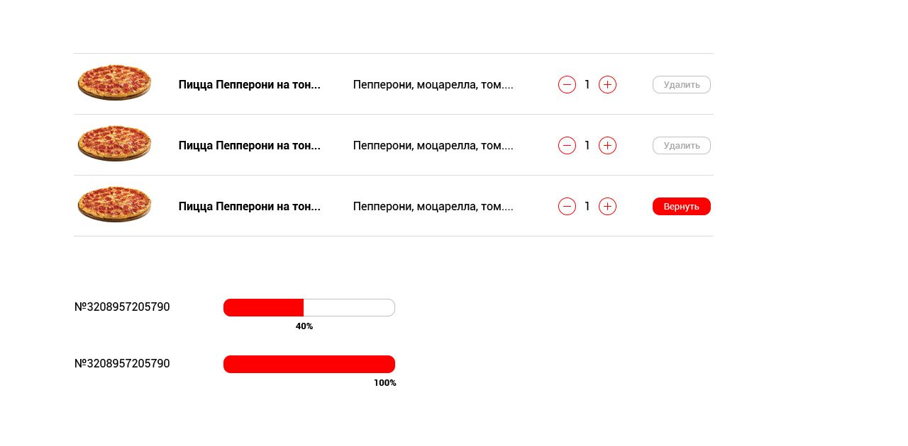

# ENDY 2

***

## Что включено

- [Gulp.js](https://github.com/gulpjs/gulp)
- [Webpack](https://github.com/webpack/webpack)
- [Babel](https://github.com/babel/babel)
- [ESLint](https://github.com/eslint/eslint) и [Airbnb's base config](https://www.npmjs.com/package/eslint-config-airbnb-base)
- [Pug](https://github.com/pugjs/pug)
- [Sass](http://sass-lang.com) и [PostCSS](https://github.com/postcss/postcss)' [Autoprefixer](https://github.com/postcss/autoprefixer)

## Установка и сборка

```js
npm i // - установка зависимостей
npm start // - запуск девелоперской версии на локальном сервере
npm run build // - запуск сборки для продакшна
npm run preview // - запуск сборки для продакшна на локальном сервере
```

## О задаче



1. Счетчик количества с возможностью добавления, отнимания количества. При количестве "1" - декремент сделать opacity: 0.5, запретить клик по элементу.
2. Возможность удаления товара. При нажатии кнопки "Удалить", кнопка меняет свое состояние на "Вернуть". Сама строка становится полупрозрачной, за исключением кнопки "Вернуть".
3. Клик на "Вернуть" возвращает строку в исходное состояние прозрачности и меняет кнопку на "Удалить"
4. Прогресс бар реализуется при взаимодействии с бэкендом. Бэкенд делать не надо, механика шкалы следующая: в атрибут data-progress передается значение, например "50". Значение из атрибута определяет длину заполненного бара в процентном эквиваленте - 50%. Цифровое обозначение прогресса тоже берется из data-progress, к нему добавляется символ %. Значение выводится в конце заполненного прогресс-бара.

***
Лайф версия доступна по [ссылке](https://topus009.github.io/endy2/)
